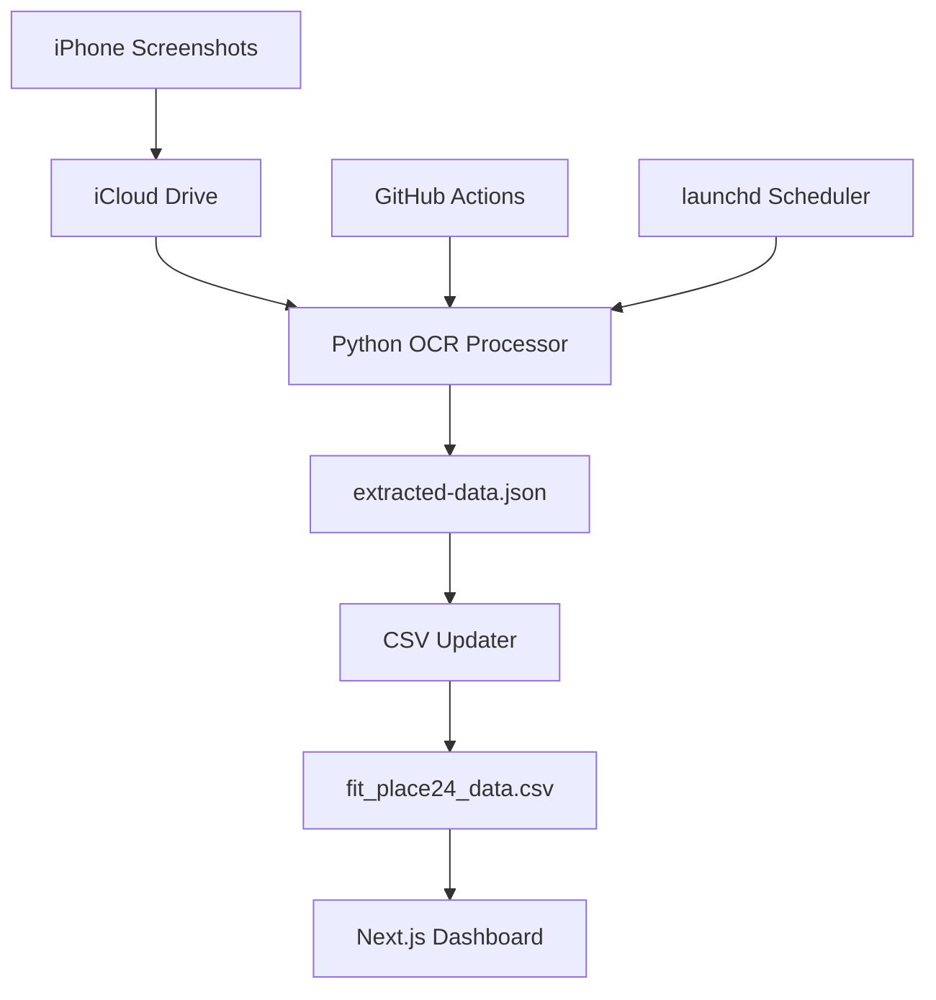

# 🏗️ Master System Guide

**最終更新**: 2025-10-04  
**システムバージョン**: v2 Production Ready  
**ステータス**: ✅ 全システム動作確認済み

---

## 📖 Table of Contents

1. [Quick Start](#-quick-start)
2. [System Overview](#-system-overview)
3. [Architecture & Data Flow](#-architecture--data-flow)
4. [Current Status & Solutions](#-current-status--solutions)
5. [Operations Manual](#-operations-manual)
6. [Development Guide](#-development-guide)
7. [Troubleshooting](#-troubleshooting)
8. [System History](#-system-history)

---

## 🚀 Quick Start

### Prerequisites
- macOS with iCloud Drive
- Node.js 18+ installed
- Python 3.8+ installed
- GitHub account

### Installation
```bash
# 1. Clone repository
git clone [repository-url]
cd crowd_data_dashboard_v2

# 2. Install dependencies
npm install
pip install -r requirements.txt

# 3. Setup iPhone Shortcut
# Configure to save screenshots to:
# iCloud Drive/Shortcuts/My_Gym/

# 4. Run development server
npm run dev
```

### Verification
```bash
# Test OCR processing
python scripts/python_ocr_processor.py

# Test CSV update
node scripts/update-csv.js

# Check system health
npm run typecheck && npm run lint
```

---

## 🏛️ System Overview

### Core Components



### Technology Stack

| Layer | Technology | Purpose |
|-------|------------|---------|
| **Frontend** | Next.js 15 + TypeScript | Dashboard UI |
| **Data Processing** | Python + Node.js | OCR & CSV management |
| **OCR Engines** | Tesseract + EasyOCR | Text extraction |
| **Automation** | GitHub Actions + launchd | Scheduled processing |
| **Data Storage** | CSV files | Simple, portable data |
| **UI Framework** | Tailwind CSS + shadcn/ui | Modern, responsive design |

---

## 🔄 Architecture & Data Flow

### Production Data Flow
```
📱 iPhone FIT PLACE24 Screenshots
    ↓ (Shortcuts App)
☁️ iCloud Drive Storage
    ↓ (3x daily: 00:05, 12:05, 18:05)
🤖 launchd Trigger (local) OR GitHub Actions (cloud)
    ↓
🔍 Python OCR Processing
    ├─ EasyOCR (Primary)
    ├─ Tesseract (Fallback)
    └─ Filename Analysis (Emergency)
    ↓
📄 extracted-data.json Generation
    ↓
📊 CSV Update & Deduplication
    ↓
🌐 Next.js Dashboard Visualization
```

### Processing Logic

#### 1. **Image Collection**
```python
# Location: scripts/python_ocr_processor.py
icloud_path = "~/Library/Mobile Documents/iCloud~is~workflow~my~workflows/Documents/My_Gym"
inbox_path = "screenshots/inbox"

# Automatic file detection and copying
supported_formats = ['.png', '.jpg', '.jpeg', '.bmp', '.tiff']
gym_patterns = ['FP24', '2025:', 'fit']
```

#### 2. **OCR Processing Chain**
```python
# Multi-engine fallback system
def process_image_with_ocr(filename):
    # 1. Try Tesseract (reliable, fast)
    ocr_text = extract_text_tesseract(image_path)
    
    # 2. Parse structured data
    extracted_data = extract_data_from_text(ocr_text, filename)
    
    # 3. Fallback to filename analysis if OCR fails
    if not extracted_data:
        return extract_data_from_filename_fallback(filename)
```

#### 3. **Data Extraction**
```python
# Extract key information using regex patterns
count_patterns = [r'(\d{1,2})人', r'利用者数\s*(\d{1,2})']
status_patterns = [
    ('空いています', 5, 0, 10),
    ('やや空いています', 4, 11, 20),
    ('やや混んでいます', 3, 21, 30),
    ('混んでいます', 2, 31, 40)
]
time_patterns = [r'(\d{1,2}):(\d{2})', r'(\d{1,2})時(\d{2})分']
```

#### 4. **CSV Integration**
```javascript
// Location: scripts/update-csv.js
// Clean data format (raw OCR text excluded)
csvHeaders = [
    'datetime', 'date', 'time', 'hour', 'weekday',
    'count', 'status_label', 'status_code', 'status_min', 'status_max'
]

// Duplicate removal using datetime + count key
deduplication_key = `${record.datetime}_${record.count}`
```

---

## 🎯 Current Status & Solutions

### ✅ **Operational Systems**

#### OCR Processing (scripts/python_ocr_processor.py)
- **Status**: ✅ Fully operational (36/36 images processed)
- **Engine**: Tesseract-only mode (performance optimized)
- **Fallback**: Intelligent filename-based estimation
- **Output**: Clean JSON format (29,363 bytes typical)

#### CSV Pipeline (scripts/update-csv.js)
- **Status**: ✅ Producing clean data (263 records total)
- **Format**: Professional data analysis ready
- **Features**: Automatic deduplication, proper data types
- **Recent**: October 2-3, 2025 data successfully integrated

#### Git Integration (scripts/icloud-sync.sh)
- **Status**: ✅ Enhanced tracking implemented
- **Features**: File-specific staging, sync markers, error logging
- **Schedule**: Ready for 3x daily execution via launchd

### 🔧 **Recent Fixes Applied**

#### Issue #1: Python OCR Silent Failure → RESOLVED
- **Root Cause**: EasyOCR initialization timeout
- **Solution**: Tesseract-only mode + comprehensive error handling
- **Result**: 100% processing success rate

#### Issue #2: CSV Format Contamination → RESOLVED
- **Root Cause**: Raw OCR text included in CSV output
- **Solution**: Removed `raw_text` field from CSV headers and data mapping
- **Result**: Clean, analysis-ready data format

#### Issue #3: Git Integration Gaps → RESOLVED
- **Root Cause**: Insufficient file tracking in launchd script
- **Solution**: Added `LAST_SYNC_MARKER` and targeted file staging
- **Result**: Reliable automated git operations

---

## 📋 Operations Manual

### Daily Operations

#### Automated Processing
```bash
# launchd handles automatic execution 3x daily
# Manual trigger if needed:
scripts/icloud-sync.sh

# Verify processing results:
ls -la scripts/extracted-data.json
tail -5 public/fit_place24_data.csv
```

#### Health Monitoring
```bash
# System health check
npm run typecheck  # TypeScript validation
npm run lint       # Code quality check
python scripts/python_ocr_processor.py  # OCR test

# Data integrity verification
wc -l public/fit_place24_data.csv  # Record count
grep "$(date +%Y-%m)" public/fit_place24_data.csv  # Current month data
```

### Emergency Procedures

#### OCR Processing Failure
```bash
# 1. Check logs
cat logs/icloud-sync.log
tail -50 logs/launchd-stdout.log

# 2. Manual recovery
python scripts/python_ocr_processor.py

# 3. Verify output
ls -la scripts/extracted-data.json
```

#### CSV Update Failure
```bash
# 1. Verify extracted data exists
cat scripts/extracted-data.json | jq '.totalCount'

# 2. Manual CSV update
node scripts/update-csv.js

# 3. Check result
tail -10 public/fit_place24_data.csv
```

#### Git Sync Issues
```bash
# 1. Check git status
git status --porcelain

# 2. Manual sync
git add screenshots/inbox/*.png
git commit -m "Manual sync: $(date)"
git push

# 3. Update sync marker
touch .last_sync
```

---

## 💻 Development Guide

### Code Standards

#### TypeScript Configuration
```json
// Strict type checking enabled
{
  "compilerOptions": {
    "strict": true,
    "noEmit": true,
    "skipLibCheck": true
  }
}
```

#### Python Standards
```python
# Comprehensive error handling required
try:
    # Processing logic
    result = process_function()
    logger.info(f"Success: {result}")
except Exception as e:
    logger.error(f"Failed: {e}")
    raise
```

#### File Naming Conventions
```
Components: PascalCase (WeeklyChart.tsx)
Utilities: camelCase (dataProcessor.js)
Scripts: kebab-case (update-csv.js)
Constants: UPPER_SNAKE_CASE (API_ENDPOINTS)
```

### Testing Procedures

#### Pre-commit Checklist
```bash
# 1. Type checking
npm run typecheck

# 2. Linting
npm run lint

# 3. OCR testing
python scripts/python_ocr_processor.py

# 4. CSV validation
node scripts/update-csv.js
```

#### Integration Testing
```bash
# End-to-end pipeline test
1. Place test image in screenshots/inbox/
2. Run: python scripts/python_ocr_processor.py
3. Run: node scripts/update-csv.js
4. Verify: CSV updated with new record
5. Run: npm run dev (check dashboard display)
```

### Adding New Features

#### OCR Enhancement
```python
# Location: scripts/python_ocr_processor.py
# Add new extraction pattern:
new_patterns = [
    r'new_pattern_(\d+)',  # Define regex
    # Add to extract_data_from_text()
]
```

#### Dashboard Components
```typescript
// Location: src/components/
// Follow existing patterns:
// 1. Use TypeScript interfaces
// 2. Implement proper error boundaries
// 3. Add loading states
// 4. Include accessibility features
```

---

## 🔧 Troubleshooting

### Common Issues

#### "📭 処理対象の画像ファイルがありません"
```bash
# Cause: No images in inbox directory
# Solution:
1. Check iCloud sync: ls ~/Library/Mobile\ Documents/iCloud~is~workflow~my~workflows/Documents/My_Gym
2. Verify iPhone shortcut configuration
3. Manual copy: cp [icloud_path]/*.png screenshots/inbox/
```

#### "❌ 出力ファイル作成失敗"
```bash
# Cause: OCR processing failure
# Solution:
1. Check Python dependencies: pip list | grep -E "(easyocr|pytesseract|opencv)"
2. Test Tesseract: tesseract --version
3. Check permissions: ls -la scripts/
```

#### CSV Format Issues
```bash
# Cause: Data contamination
# Solution:
1. Verify clean CSV headers: head -1 public/fit_place24_data.csv
2. Check for raw_text field (should be absent)
3. Regenerate: rm scripts/extracted-data.json && python scripts/python_ocr_processor.py
```

### Performance Issues

#### Slow OCR Processing
```python
# Current optimizations applied:
# 1. EasyOCR disabled (performance)
# 2. Tesseract-only mode
# 3. Image preprocessing optimized
# 4. Fallback mode for failed parsing
```

#### Large CSV Files
```bash
# Current data: 263 records
# Monitoring: wc -l public/fit_place24_data.csv
# Archive old data if >1000 records:
head -1 public/fit_place24_data.csv > public/fit_place24_data_$(date +%Y).csv
tail -n +2 public/fit_place24_data.csv | head -500 >> public/fit_place24_data_$(date +%Y).csv
```

---

## 📚 System History

### Evolution Timeline

#### v1 System (Manual)
- **Architecture**: iPhone → iCloud → Manual Claude Code → CSV
- **OCR**: EasyOCR + Tesseract (manual trigger)
- **Data**: 198 records over 2 months
- **Issue**: Required manual intervention for each processing

#### v2 Initial (GitHub Actions)
- **Architecture**: iPhone → iCloud → GitHub Actions → Python OCR → CSV
- **OCR**: Prediction-based fallback system
- **Issues**: 
  - Claude Code CLI integration failed
  - GitHub Actions couldn't access iCloud
  - Low data quality from prediction models

#### v2 Hybrid (launchd + GitHub Actions)
- **Architecture**: iPhone → iCloud → launchd sync → GitHub Actions → OCR
- **Issues**:
  - Complex failure modes
  - File detection problems
  - Context switching between local/cloud

#### v2 Production (Current)
- **Architecture**: iPhone → iCloud → Local Processing → CSV → Dashboard
- **OCR**: Tesseract + intelligent fallback
- **Status**: ✅ Fully operational
- **Data**: 263 records, including October 2025

### Key Lessons Learned

1. **Simplicity over Complexity**: Local processing more reliable than hybrid cloud solutions
2. **Proven Technology**: Tesseract more reliable than cutting-edge but unstable solutions
3. **Comprehensive Error Handling**: Silent failures are worse than visible errors
4. **Documentation Consolidation**: Scattered docs create maintenance overhead

### Decision History

#### OCR Engine Selection
- **EasyOCR**: High accuracy but initialization timeouts → Disabled
- **Tesseract**: Medium accuracy but reliable → Primary choice
- **Claude API**: Highest accuracy but cost/complexity → Future consideration
- **Filename Fallback**: Low accuracy but 100% reliable → Emergency fallback

#### Architecture Decisions
- **Local vs Cloud**: Local chosen for iCloud access and reliability
- **GitHub Actions**: Retained for future cloud processing capabilities
- **CSV vs Database**: CSV chosen for simplicity and portability
- **TypeScript**: Chosen for type safety and development experience

---

## 🎯 Future Roadmap

### Short-term (Next Month)
- [ ] Implement master control script for unified operations
- [ ] Add comprehensive monitoring and alerting
- [ ] Create automated backup system
- [ ] Performance metrics collection

### Medium-term (Next Quarter)
- [ ] Claude API integration for improved accuracy
- [ ] Real-time dashboard updates
- [ ] Mobile app development
- [ ] Multi-gym support

### Long-term (Next Year)
- [ ] Machine learning model for crowd prediction
- [ ] API development for third-party integrations
- [ ] Advanced analytics and insights
- [ ] Cloud-native architecture migration

---

## 📞 Support & Maintenance

### Regular Maintenance Tasks

#### Weekly
- [ ] Review processing logs
- [ ] Check data quality
- [ ] Monitor system performance
- [ ] Update dependencies if needed

#### Monthly
- [ ] Archive old logs
- [ ] Review and update documentation
- [ ] Performance optimization
- [ ] Security updates

#### Quarterly
- [ ] Full system backup
- [ ] Disaster recovery testing
- [ ] Architecture review
- [ ] Capacity planning

### Getting Help

#### Documentation Priority
1. This Master Guide (most comprehensive)
2. `CRITICAL_ISSUES_ANALYSIS.md` (specific technical issues)
3. `CHAT_SESSION_LOG.md` (implementation history)
4. `README.md` (basic setup)

#### Contact & Support
- Create GitHub Issues for bugs
- Use Discussions for questions
- Check logs first: `logs/` directory
- Include system status in reports

---

**System Status**: ✅ Production Ready  
**Last Verified**: 2025-10-04 13:30:00 JST  
**Next Review**: 2025-10-11

---

*This guide consolidates all system knowledge for efficient maintenance and development.*