# System Architecture

**Last Updated**: 2025-01-XX  
**Purpose**: Complete technical architecture documentation with visual diagrams

---

## System Overview

### High-Level Architecture

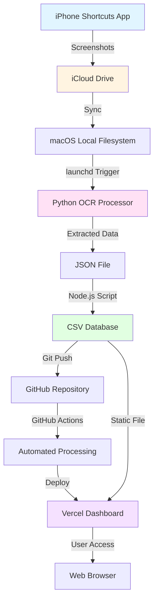

### Component Relationships

```mermaid
graph LR
    subgraph "Data Collection"
        A1[iPhone] --> A2[Shortcuts]
        A2 --> A3[iCloud]
    end
    
    subgraph "Local Processing"
        B1[launchd] --> B2[Sync Script]
        B2 --> B3[OCR Script]
        B3 --> B4[CSV Updater]
    end
    
    subgraph "Cloud Processing"
        C1[GitHub] --> C2[Actions]
        C2 --> C3[OCR]
        C3 --> C4[CSV Update]
    end
    
    subgraph "Frontend"
        D1[Next.js] --> D2[React]
        D2 --> D3[Charts]
        D3 --> D4[User]
    end
    
    A3 --> B1
    B4 --> C1
    C4 --> D1
```

---

## Data Flow Diagrams

### Complete Data Flow

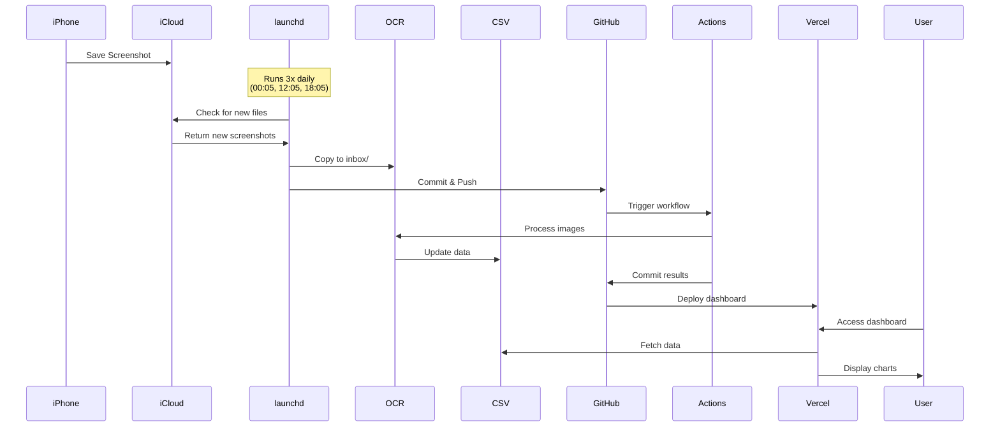

### OCR Processing Pipeline

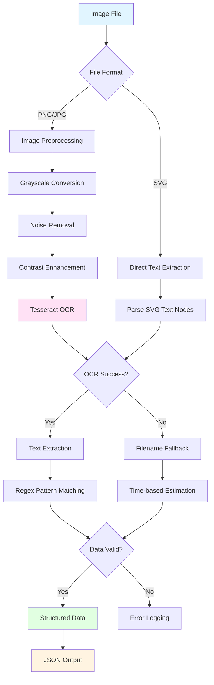

### CSV Update and Deduplication

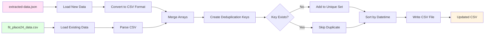

### Dashboard Rendering Flow

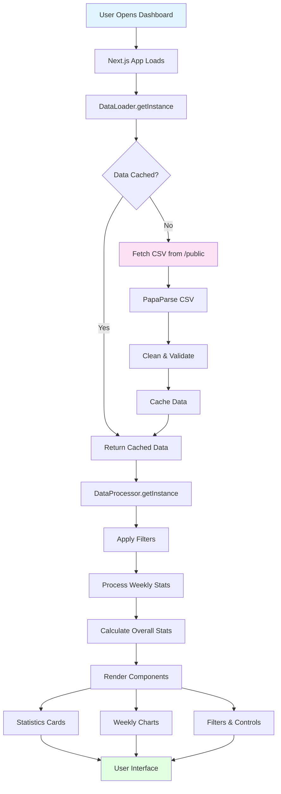

---

## Frontend Architecture

### Next.js App Structure

```
src/
├── app/
│   ├── layout.tsx          # Root layout (theme provider, metadata)
│   ├── page.tsx            # Main dashboard page
│   └── globals.css         # Global styles (Tailwind)
├── components/
│   ├── charts/
│   │   └── weekly-chart.tsx    # Chart component (Chart.js)
│   ├── dashboard/
│   │   └── statistics-card.tsx # Stats display cards
│   ├── ui/                      # shadcn/ui components
│   │   ├── button.tsx
│   │   ├── dialog.tsx
│   │   └── ...
│   ├── calendar-filter.tsx      # Date range picker
│   ├── language-switcher.tsx    # JP/EN toggle
│   ├── mode-toggle.tsx          # Dark/light mode
│   ├── mobile-menu.tsx          # Mobile navigation
│   └── floating-refresh-button.tsx  # Mobile refresh
└── lib/
    ├── dataLoader.ts       # CSV loading & caching
    ├── dataProcessor.ts    # Data aggregation & filtering
    └── translations.ts     # i18n translations
```

### Component Hierarchy

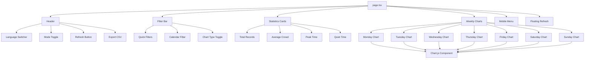

### State Management

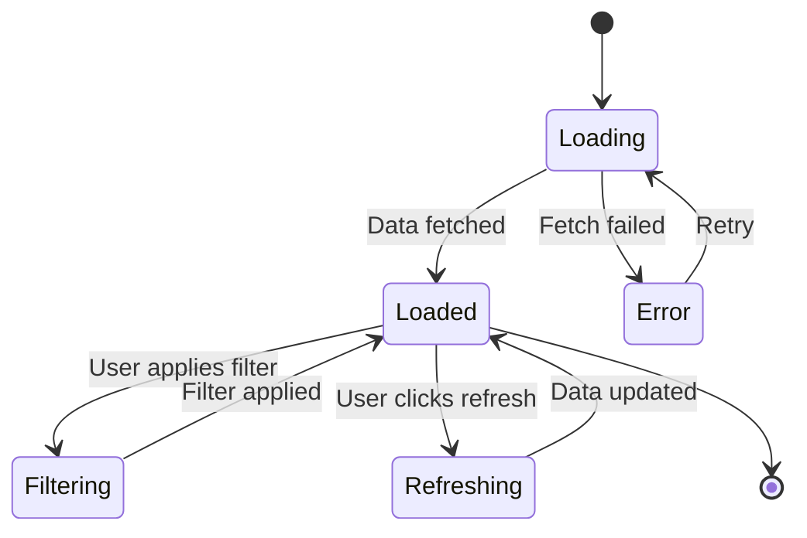

**State Flow**:
1. **Initial Load**: Component mounts → `loading: true` → Fetch CSV → Parse → `loading: false`, `data: [...]`
2. **Filtering**: User selects date range → `filter` state updates → Re-process data → Re-render charts
3. **Refreshing**: User clicks refresh → `loading: true` → Force fetch (bypass cache) → Update data
4. **Error Handling**: Fetch fails → `error: "message"` → Show error UI → User can retry

### Data Processing Flow

```typescript
// Simplified data flow in TypeScript

// 1. Load CSV
const rawData = await DataLoader.getInstance().loadCSVData()
// Returns: CrowdData[] with all records

// 2. Apply Filters
const filteredData = DataProcessor.getInstance().filterData(rawData, {
  period: 'week',
  startDate: null,
  endDate: null
})
// Returns: Filtered CrowdData[]

// 3. Process Weekly Stats
const weeklyStats = DataProcessor.getInstance().processWeeklyData(filteredData)
// Returns: WeeklyStats[] (one per weekday)
// Each contains: hourly averages, peak times, etc.

// 4. Calculate Overall Stats
const overallStats = DataProcessor.getInstance().calculateOverallStats(filteredData)
// Returns: OverallStats with totals, averages, peaks, quiet times

// 5. Render Components
<StatisticsCard data={overallStats} />
<WeeklyChart data={weeklyStats[0]} /> // Monday
<WeeklyChart data={weeklyStats[1]} /> // Tuesday
// ... etc
```

---

## Backend Architecture

### Python OCR Pipeline

```
scripts/
├── python_ocr_processor.py    # Main OCR processor
│   ├── ProductionOCRProcessor class
│   ├── collect_from_icloud()  # Get screenshots
│   ├── preprocess_image()     # Image cleanup
│   ├── extract_text_tesseract()  # OCR execution
│   ├── extract_data_from_text()  # Parse OCR results
│   └── extract_data_from_filename_fallback()  # Fallback
└── extracted-data.json         # Output file
```

**Class Structure**:
```python
class ProductionOCRProcessor:
    def __init__(self):
        # Initialize paths, OCR engines, logging
        
    def collect_from_icloud(self):
        # Copy new screenshots from iCloud to inbox/
        
    def preprocess_image(self, image_path):
        # OpenCV preprocessing: grayscale, denoise, enhance
        
    def extract_text_tesseract(self, image_path):
        # Run Tesseract OCR with Japanese language
        
    def extract_data_from_text(self, ocr_text, filename):
        # Regex patterns to extract count, status, time
        
    def extract_data_from_filename_fallback(self, filename):
        # Intelligent estimation when OCR fails
        
    def process_all_images(self):
        # Main orchestration method
```

### Node.js CSV Processor

```
scripts/
├── update-csv.js              # CSV updater
│   ├── CSVDataUpdater class
│   ├── loadExtractedData()    # Read JSON
│   ├── loadExistingCSV()      # Read CSV
│   ├── convertToCSVFormat()   # Transform data
│   ├── removeDuplicates()     # Deduplication
│   └── writeCSVFile()         # Save updated CSV
└── public/
    └── fit_place24_data.csv   # Output file
```

**Deduplication Logic**:
```javascript
// Key: datetime + count (e.g., "2025-01-15 14:30:00_22")
const key = `${record.datetime}_${record.count}`

// Why datetime + count?
// - Same time, different count = different measurement (keep both)
// - Same time, same count = duplicate (remove)
```

---

## Automation Architecture

### launchd Jobs

**Job 1: iCloud Sync** (`com.mygym.icloud-sync.plist`)
```
Schedule: 3x daily (00:05, 12:05, 18:05)
Script: scripts/icloud-sync.sh
Purpose: Sync screenshots from iCloud to local inbox
Output: Git commit + push (triggers GitHub Actions)
```

**Job 2: Weekly Process** (`com.mygym.weekly-process.plist`)
```
Schedule: Weekly (Sunday 00:00)
Script: scripts/weekly-process.sh
Purpose: Comprehensive data processing
Steps:
  1. iCloud sync
  2. OCR processing
  3. CSV update
  4. Image archiving
  5. Report generation
  6. Git commit + push
```

### GitHub Actions Workflow

```yaml
# .github/workflows/weekly-data-collection.yml

Trigger: Push to screenshots/inbox/** or public/fit_place24_data.csv

Jobs:
  collect-data:
    Steps:
      1. Checkout repository
      2. Setup Node.js
      3. Setup Python
      4. Install OCR dependencies (Tesseract)
      5. Check for new screenshots
      6. If new screenshots:
         - Run OCR processing
         - Update CSV
         - Archive images
         - Generate reports
      7. Commit and push changes
      8. Rebuild dashboard (npm run build)
```

**Why This Architecture?**:
- **Push-triggered**: More reliable than schedule
- **Conditional processing**: Only runs when needed
- **Automatic deployment**: Dashboard rebuilds on changes

---

## File Structure Explanation

### Root Directory

```
crowd_data_dashboard_v2/
├── .github/
│   └── workflows/          # GitHub Actions automation
├── _archive/               # Old documentation (reference only)
├── docs/                   # Project documentation
├── logs/                   # Automation logs
├── public/                 # Static files (CSV, images)
├── screenshots/
│   ├── inbox/             # New screenshots (processing queue)
│   └── processed/         # Archived screenshots
├── scripts/                # Automation scripts
├── src/                    # Next.js application source
└── [config files]          # package.json, tsconfig.json, etc.
```

### Key Directories

**`screenshots/inbox/`**:
- **Purpose**: Queue for new screenshots awaiting processing
- **Source**: Copied from iCloud by `icloud-sync.sh`
- **Processing**: OCR script reads from here
- **Cleanup**: Moved to `processed/` after successful processing

**`screenshots/processed/`**:
- **Purpose**: Archive of processed screenshots
- **Structure**: `YYYYMMDD_HHMMSS/` subdirectories
- **Retention**: Kept for reference, can be cleaned up manually

**`public/`**:
- **Purpose**: Static files served by Next.js
- **Key File**: `fit_place24_data.csv` (the database)
- **Access**: Available at `/fit_place24_data.csv` in browser

**`scripts/`**:
- **Purpose**: All automation and processing scripts
- **Types**: Python (OCR), Node.js (CSV), Bash (automation)
- **Execution**: Run by launchd or GitHub Actions

**`src/`**:
- **Purpose**: Next.js application code
- **Structure**: App Router (Next.js 15)
- **Components**: React components, utilities, styles

---

## Module Dependencies

### Frontend Dependencies

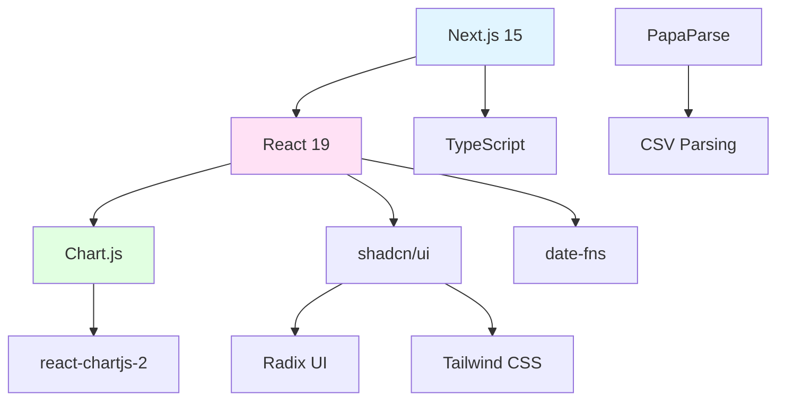

**Key Libraries**:
- **Next.js**: React framework with App Router
- **Chart.js**: Chart rendering (line, bar charts)
- **PapaParse**: CSV parsing in browser
- **date-fns**: Date manipulation and formatting
- **shadcn/ui**: UI component library
- **Tailwind CSS**: Utility-first CSS framework

### Backend Dependencies

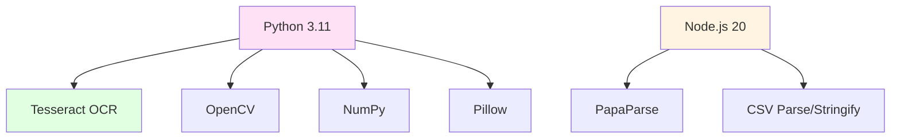

**Key Libraries**:
- **Tesseract OCR**: Text extraction from images
- **OpenCV**: Image preprocessing (noise removal, enhancement)
- **PapaParse (Node.js)**: CSV parsing and generation
- **csv-parse/csv-stringify**: Alternative CSV handling

---

## Deployment Architecture

### Vercel Deployment

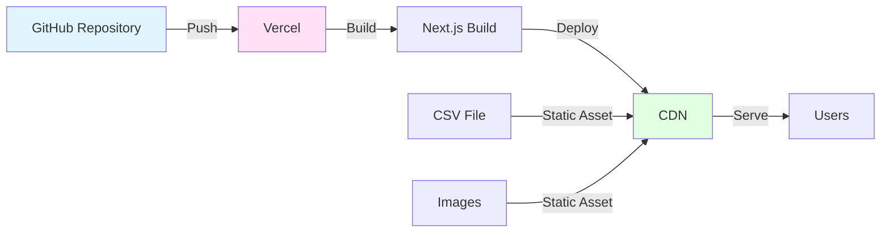

**Deployment Flow**:
1. Code pushed to GitHub
2. Vercel detects push (via GitHub integration)
3. Vercel runs `npm run build`
4. Build output deployed to global CDN
5. Users access via `https://crowd-data-dashboard-v2.vercel.app`

**Static Assets**:
- CSV file: `public/fit_place24_data.csv` → `/fit_place24_data.csv`
- Images: `public/*.svg` → `/*.svg`
- All served from CDN for fast global access

### GitHub Integration

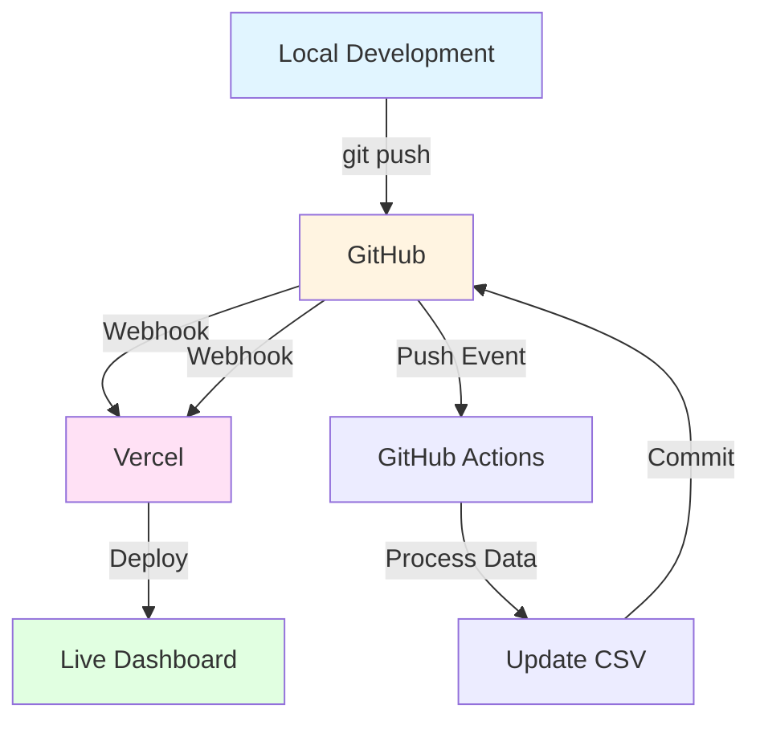

---

## Data Models

### CrowdData Interface

```typescript
interface CrowdData {
  datetime: string;        // "2025-01-15 14:30:00"
  date: string;            // "2025-01-15"
  time: string;            // "14:30"
  hour: number;            // 14
  weekday: string;         // "Wednesday"
  count: number;           // 22
  status_label: string;    // "やや混んでいます（~30人）"
  status_code: number;     // 3
  status_min: number;      // 21
  status_max: number;      // 30
}
```

### WeeklyStats Interface

```typescript
interface WeeklyStats {
  weekday: string;         // "月曜日" or "Monday"
  data: HourlyData[];      // 24 hours of data
  avgCount: number;        // Average for the day
  peakHour: number;        // Hour with highest average
  peakCount: number;       // Count at peak hour
}

interface HourlyData {
  hour: number;            // 0-23
  avgCount: number;        // Average count for this hour
  dataPoints: number;      // Number of samples
}
```

### OverallStats Interface

```typescript
interface OverallStats {
  totalRecords: number;
  avgCount: number;
  peakTime: string;        // "Wednesday 19:00"
  peakWeekday: string;
  peakHour: number;
  peakCount: number;
  quietTime: string;       // "Monday 6:00"
  quietWeekday: string;
  quietHour: number;
  quietCount: number;
  dateRange: {
    start: string;         // "2025-06-29"
    end: string;           // "2025-11-23"
  };
}
```

---

## Security Considerations

### Current Security Posture

**Public Repository**:
- ✅ No sensitive data in code
- ✅ No API keys or secrets
- ✅ CSV contains only crowd numbers (no personal info)

**Access Control**:
- ✅ Dashboard is public (no authentication needed)
- ✅ GitHub repository is public
- ✅ Vercel deployment is public

**Data Privacy**:
- ✅ No personal information collected
- ✅ Only aggregate crowd numbers
- ✅ Screenshots processed locally, not stored in cloud

### Future Security Considerations

If adding authentication or personalization:
- Use environment variables for secrets
- Implement user authentication (NextAuth.js)
- Add rate limiting for API endpoints
- Encrypt sensitive data at rest

---

## Performance Considerations

### Current Performance

**Dashboard Load Time**:
- Initial load: ~2-3 seconds
- CSV parsing: ~100-200ms (263 records)
- Chart rendering: ~500ms (7 charts)
- Total: <3 seconds

**Optimizations Applied**:
- ✅ Data caching (5-minute cache in DataLoader)
- ✅ Static CSV file (no database queries)
- ✅ Client-side rendering (fast interactivity)
- ✅ CDN delivery (Vercel global CDN)

### Scalability

**Current Limits**:
- CSV file: ~500-1000 records (comfortable)
- Processing: ~50 images per batch (reasonable)
- Dashboard: Handles current load easily

**Future Scaling Needs**:
- If >1000 records: Consider database migration
- If >100 images/batch: Parallel processing
- If high traffic: Add caching layer (Redis)

---

## Related Documentation

- **[Project Overview](./project_overview.md)**: What this project does and why
- **[Implementation Notes](./implementation_notes.md)**: Technical decisions and constraints
- **[AI Context](./ai_context.md)**: How to work with this project
- **[Quick Start](./QUICK_START.md)**: Setup instructions
- **[Troubleshooting](./TROUBLESHOOTING.md)**: Common issues and solutions

---

**This document provides the technical "how" of the system. For the "why" behind decisions, see Implementation Notes.**
