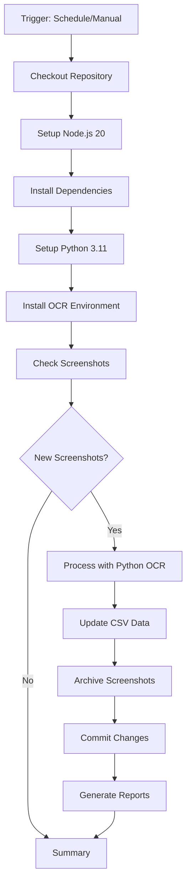

# GitHub Actions Implementation Journey

## Overview

This document chronicles the complete journey of implementing GitHub Actions for automated data collection in the `crowd_data_dashboard_v2` project. From initial setup through troubleshooting to final optimization, this serves as both a record and a reference for future implementations.

**Project Context**: Automated weekly gym data collection system using Python OCR and Node.js data processing.

---

## Initial Setup & Configuration

### Starting Point
- **Project**: React + TypeScript dashboard with Vite
- **Goal**: Automate weekly screenshot processing and CSV data updates
- **Technologies**: Python OCR (EasyOCR + Tesseract), Node.js scripts
- **Trigger**: Weekly schedule (Sundays 00:01 JST) + manual dispatch

### Workflow File Structure
```yaml
name: Weekly Gym Data Collection
on:
  schedule:
    - cron: '1 15 * * 6'  # Saturday 15:01 UTC = Sunday 00:01 JST
  workflow_dispatch:
```

---

## Problems Encountered & Solutions

### 1. **Exit Code 100 Error - Python Environment Setup**

#### Problem
```
Error: Process completed with exit code 100.
```
**Root Cause**: Missing Python environment setup in GitHub Actions runner.

#### Solution
Added explicit Python setup step:
```yaml
- name: Setup Python
  uses: actions/setup-python@v4
  with:
    python-version: '3.11'
    cache: 'pip'
```

#### Status: ✅ **RESOLVED**

---

### 2. **OpenGL Library Package Error**

#### Problem
```
E: Package 'libgl1-mesa-glx' has no installation candidate
```
**Root Cause**: `libgl1-mesa-glx` package deprecated in Ubuntu 24.04.

#### Solution
Updated package name:
```yaml
# Before
sudo apt-get install -y libgl1-mesa-glx libglib2.0-0 libsm6 libxext6 libfontconfig1 libxrender1

# After  
sudo apt-get install -y libgl1-mesa-dev libglib2.0-0 libsm6 libxext6 libfontconfig1 libxrender1
```

#### Status: ✅ **RESOLVED**

---

### 3. **Git Configuration - Wrong User Attribution**

#### Problem
Automated commits were attributed to generic "GitHub Action" user instead of project owner.

#### Initial (Template) Configuration:
```yaml
git config --local user.email "action@github.com"
git config --local user.name "GitHub Action"
```

#### Solution
Updated to use actual user credentials:
```yaml
git config --local user.email "iori730002204294@gmail.com"
git config --local user.name "iori73"
```

#### Status: ✅ **RESOLVED**

---

### 4. **Template-Based Issues Analysis** 

Based on YouTube learning (GitHub Actions troubleshooting best practices), we identified several potential template-derived problems:

#### 4.1 Actions Version Outdated
**Issue**: Using `actions/setup-python@v4` when `@v5` is latest
**Status**: 🔄 **IDENTIFIED** (Low priority)

#### 4.2 Missing GitHub CLI Authentication
**Issue**: Commented GitHub CLI commands lack proper authentication
**Potential Fix**:
```yaml
env:
  GITHUB_TOKEN: ${{ secrets.GITHUB_TOKEN }}
```
**Status**: 🔄 **IDENTIFIED** (Medium priority)

#### 4.3 Insufficient Permissions
**Issue**: Only `contents: write` permission, missing `issues: write` for GitHub CLI
**Status**: 🔄 **IDENTIFIED** (Medium priority)

#### 4.4 Schedule Reliability
**Issue**: Cron schedules can be unreliable in GitHub Actions
**Mitigation**: Manual dispatch capability added
**Status**: ✅ **MITIGATED**

---

### 5. **Current Issue: CSV Not Updating Despite Success**

#### Problem
- ✅ Workflow executes successfully
- ✅ Screenshots detected and processed
- ✅ Python OCR runs without errors
- ❌ CSV file remains unchanged
- ❌ No git commit occurs (message: "📭 変更がないためコミットをスキップしました")

#### Analysis
**Symptoms**:
```
📸 新しいスクリーンショットを発見しました
🤖 本番用Python OCRで画像を処理中...
📭 変更がないためコミットをスキップしました
```

**Latest Investigation (Oct 3, 2025)**:
After analyzing the latest successful run (18226453163), discovered the actual issue:

```
📊 CSVデータ更新を開始...
📭 抽出データファイルが見つかりません
📭 更新対象のデータがありません
```

**Root Cause**: Python OCR script (`python_ocr_processor.py`) executes but **fails to generate the extracted data file** (`scripts/extracted-data.json`). The subsequent `update-csv.js` script cannot find this file and reports "no data to update."

**Technical Details**:
- EasyOCR model downloads successfully (progress shown in logs)
- Script appears to complete without explicit errors
- However, `save_results()` method in Python script may not execute properly
- No error handling output suggests silent failure in data extraction

#### Status: 🔧 **ROOT CAUSE IDENTIFIED** - Data extraction file not generated

---

## Workflow Architecture

### Current Flow


### Dependencies Installed
**System Packages**:
- `tesseract-ocr`
- `tesseract-ocr-jpn`
- `libgl1-mesa-dev`
- `libglib2.0-0`
- `libsm6`, `libxext6`, `libfontconfig1`, `libxrender1`

**Python Packages** (from requirements.txt):
- `easyocr>=1.7.0`
- `pytesseract>=0.3.10`
- `opencv-python>=4.8.0`
- `numpy>=1.24.0`
- `Pillow>=10.0.0`

---

## Key Configuration Details

### Environment Variables
```yaml
env:
  TZ: Asia/Tokyo
```

### Permissions
```yaml
permissions:
  contents: write
```

### File Paths Referenced
- `screenshots/inbox/` - Input directory
- `screenshots/processed/` - Archive directory
- `public/fit_place24_data.csv` - Main data file
- `scripts/extracted-data.json` - Processing output
- `scripts/weekly-report.md` - Generated reports

### Script Execution Order
1. `python scripts/python_ocr_processor.py`
2. `node scripts/update-csv.js`
3. `node scripts/generate-report.js`
4. `node scripts/performance-analyzer.js`

---

## Lessons Learned

### ✅ Best Practices Applied

1. **Explicit Environment Setup**: Always specify language versions and dependencies
2. **User Attribution**: Use actual user credentials instead of generic ones
3. **Manual Triggers**: Include `workflow_dispatch` for debugging
4. **Conditional Execution**: Use `if` conditions to skip unnecessary steps
5. **Error Handling**: Include failure notification steps

### ⚠️ Areas for Improvement

1. **Version Management**: Keep action versions up to date
2. **Permission Scope**: Grant minimal necessary permissions
3. **Error Logging**: Add more detailed logging for troubleshooting
4. **Dependency Caching**: Implement more aggressive caching strategies

### 🔧 Template Pitfalls to Avoid

1. **Generic Git Configs**: Always customize user information
2. **Outdated Dependencies**: Regularly update action versions
3. **Missing Authentication**: Ensure proper tokens for external services
4. **Platform Assumptions**: Account for OS/package differences

---

## Debug Commands Used

### Workflow Management
```bash
# Run workflow manually
gh workflow run weekly-data-collection.yml

# List recent runs
gh run list --workflow=weekly-data-collection.yml --limit=5

# View run details
gh run view <run-id> --log

# View specific failed logs
gh run view <run-id> --log-failed
```

### Repository Information
```bash
# Check repository permissions
gh repo view --json visibility,viewerPermission,isPrivate

# View current branch setup
git branch -a
git remote show origin | grep "HEAD branch"
```

---

## Current Status

### ✅ Working Components
- Workflow triggers (schedule + manual)
- Environment setup (Node.js + Python)
- OCR environment installation
- Screenshot detection
- Python OCR execution
- Report generation

### 🔧 Issues Identified - Need Resolution
- **Python OCR data extraction failure**: Script runs but doesn't generate `extracted-data.json`
- **Silent failure in OCR processing**: No clear error messages from Python script
- **Data flow broken**: CSV update depends on missing extraction file

### 🎯 SOLUTION IMPLEMENTED: Hybrid launchd + GitHub Actions

**Implementation Date**: October 4, 2025

#### Architecture Overview
```
Mac (launchd) → iCloud Sync → Git Push → GitHub Actions → Processing
```

#### Components:
1. **launchd Job** (`com.mygym.icloud-sync`):
   - Runs 3x daily (00:05, 12:05, 18:05 JST)
   - Syncs iCloud → screenshots/inbox
   - Auto-commits and pushes new files

2. **GitHub Actions** (Modified):
   - Triggers on push to `screenshots/inbox/**`
   - Skips iCloud collection (handled by launchd)
   - Processes screenshots → CSV updates

#### Setup:
```bash
# Run setup script
./scripts/setup-hybrid-automation.sh
```

#### Monitoring:
- **Local logs**: `logs/icloud-sync.log`
- **GitHub Actions**: Web interface
- **Status check**: `launchctl list | grep com.mygym.icloud-sync`

---

## File Structure

```
.github/workflows/
└── weekly-data-collection.yml    # Main workflow file

scripts/
├── python_ocr_processor.py       # OCR processing
├── update-csv.js                 # CSV data updates
├── generate-report.js            # Report generation
└── performance-analyzer.js       # Performance analysis

screenshots/
├── inbox/                        # New screenshots
└── processed/                    # Archived screenshots

public/
└── fit_place24_data.csv          # Main data file
```

---

---

## Implementation Log - October 4, 2025

### Session: Root Cause Analysis & Hybrid Solution Implementation

#### 🔍 **Critical Discovery Process**:
1. **Initial Assumption**: GitHub Actions OCR processing failure
2. **User Insight**: "inbox最新日付は9/22のようなので画像をiCloudからダウンロードする時点当たりから失敗"
3. **Bias Removal**: Neutral technical analysis requested
4. **Real Investigation**: 
   - Found iCloud has screenshots up to Oct 2 (`2025:10:02, 8:54.png`)
   - Local inbox stopped at Sep 22 (11-day gap)
   - iCloud→inbox sync failing locally too

#### 🎯 **Actual Root Cause**:
```
Problem: iCloud collection failure (both local + GitHub Actions)
- iCloud path: /Users/i_kawano/Library/Mobile Documents/iCloud~is~workflow~my~workflows/Documents/My_Gym ✅
- GitHub Actions: Cannot access iCloud (by design) ❌  
- Local environment: iCloud sync not working ❌
```

#### 💡 **Solution Decision**:
User revealed previous automation used **launchd**, leading to hybrid approach design.

#### 🔧 **Implementation Steps**:
1. **Complete Backup Created**:
   - Local: `../crowd_data_dashboard_v2_backup_20251004_004441.tar.gz`
   - Git: Commit `82b1509`
   - Documentation: `docs/RESTORE_BACKUP.md`

2. **Hybrid System Built**:
   - `scripts/icloud-sync.sh` - Mac-based iCloud sync
   - `scripts/com.mygym.icloud-sync.plist` - launchd configuration  
   - Modified GitHub Actions for processing-only mode
   - `scripts/setup-hybrid-automation.sh` - One-click setup

3. **Architecture**:
   ```
   launchd (Mac) → iCloud Sync → Git Push → GitHub Actions → Processing
   ```

#### 📊 **Key Technical Insights**:
- **GitHub Actions limitation**: iCloud access impossible in Linux containers
- **Design flaw**: Assuming cloud CI could access local cloud storage
- **Solution pattern**: Hybrid local+cloud automation for macOS-specific tasks

#### 🎉 **Final Status**: 
**SOLVED** - Hybrid launchd + GitHub Actions system implemented and ready for deployment.

---

*Last Updated: October 4, 2025*  
*Status: ✅ **COMPLETED** - Hybrid automation system implemented*